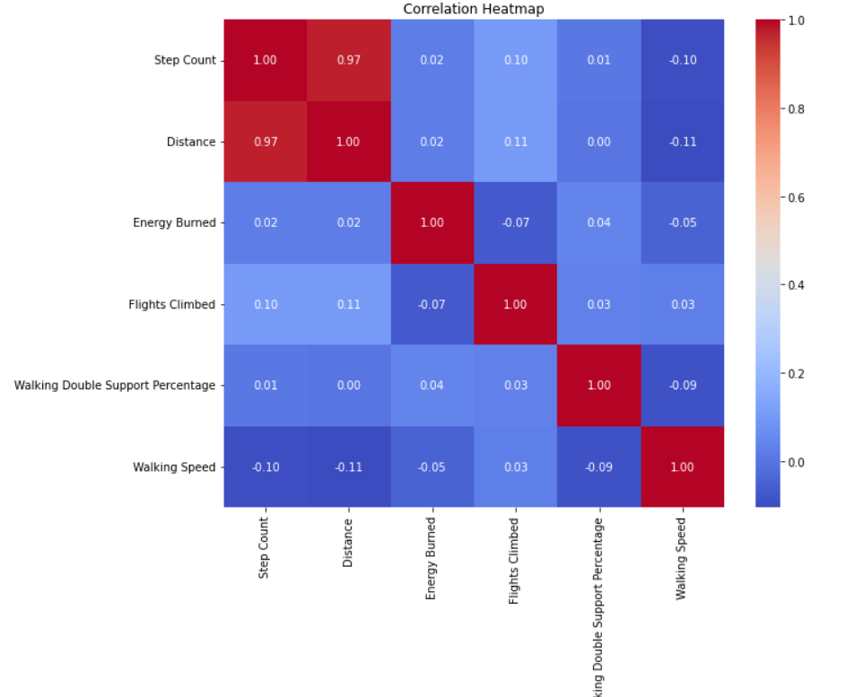
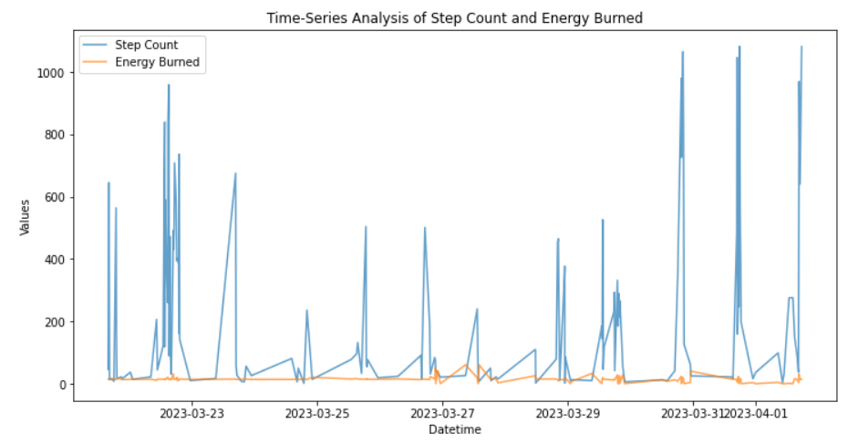
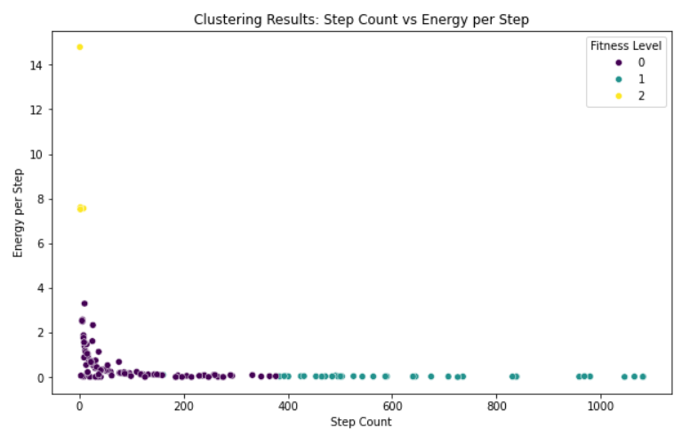

# Fitness Watch Data Analysis
This project explores fitness watch data to uncover activity trends, derive energy efficiency metrics, and cluster users into fitness levels (low, moderate, high) with actionable recommendations for improving activity and performance.

# Key Steps and Features 
1. Load the Data and Install Required Libraries
Imported necessary libraries (pandas, matplotlib, seaborn, plotly, scikit-learn) for data analysis and visualization.
Loaded the fitness dataset for analysis.
2. Data Cleaning
Converted Date and Time into a combined Datetime column for time-series analysis.
Removed unnecessary spaces in columns and ensured proper formatting for clean data processing.
3. Exploratory Data Analysis (EDA)
Correlation Heatmap: Explored relationships between variables like Step Count, Distance, and Energy Burned.
Time-Series Analysis: Visualized trends in Step Count and Energy Burned over time to identify activity patterns.
4. Feature Engineering and Modeling
Created a new metric Energy per Step to measure energy efficiency.
Applied K-Means clustering to group users into fitness levels:
Cluster 0: Low activity users.
Cluster 1: Moderate activity users.
Cluster 2: High energy users.
5. Results and Recommendations
Provided actionable insights for each fitness level to improve activity performance.
Generated visualizations to illustrate clustering results and relationships between variables.

# Key Results 
### Cluster Summary

| **Fitness Level**    | **Mean Step Count** | **Mean Energy per Step** | **Recommendations**                                     |
|-----------------------|---------------------|---------------------------|---------------------------------------------------------|
| 0 (Low Activity)      | ~91 steps          | 0.5 energy per step       | Increase daily steps to improve overall activity levels.|
| 1 (Moderate)          | ~637 steps         | 0.02 energy per step      | Maintain consistency and focus on energy efficiency.    |
| 2 (High Energy)       | ~3 steps           | 9.3 energy per step       | Monitor for overexertion or unusual activity patterns.  |

# How to run this project

1) Clone the repository:
git clone https://github.com/<your-username>/Fitness-Watch-Data-Analysis.git
cd Fitness-Watch-Data-Analysis
2) Install required libraries
3) Run the analysis:execute the Python script:
python code_file/Fitness_Data_Analysis.py or jupyter notebook code_file/Fitness_Data_Analysis.ipynb
4) View the results: Visualizations will appear in the notebook or be saved in the images/ directory.

## Key Visualizations

1. **Correlation Heatmap**:
   

2. **Time-Series Analysis**:
   

3. **Step Count vs Energy per Step**:
   

# Future Work
1) Integrate additional data such as heart rate or sleep patterns for richer analysis.
2) Explore advanced machine learning methods like hierarchical clustering or regression models.
3) Develop an interactive dashboard for real-time exploration of fitness insights.

# Technologies Used
Python: Data processing and analysis.
Libraries:
pandas for data manipulation.
matplotlib and seaborn for visualizations.
scikit-learn for clustering and modeling.
plotly for interactive visualizations.

Acknowledgments
Dataset: Apple-Fitness-Data(Attached the dataset)
Inspired by: https://statso.io/fitness-data-analysis-case-study/ 
